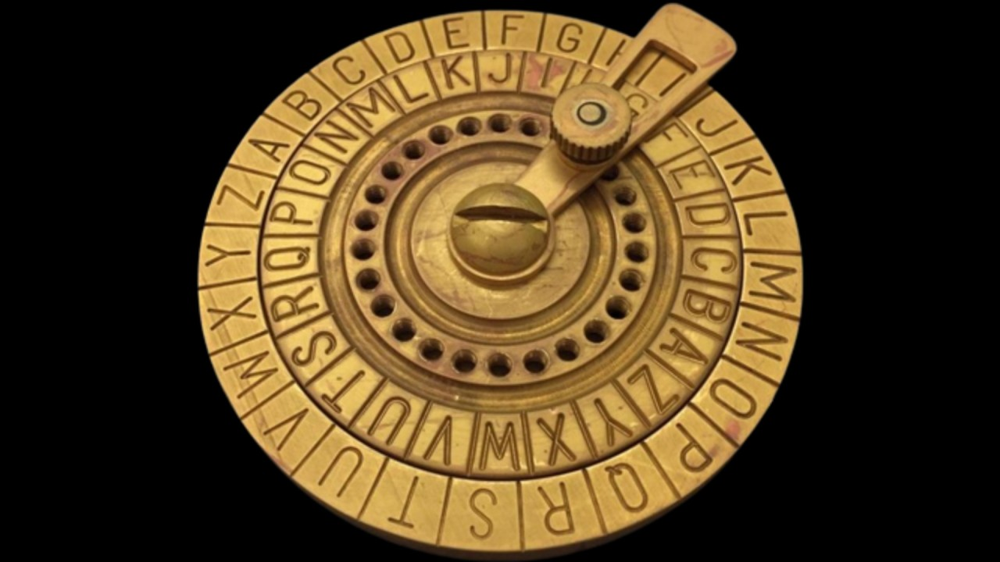

# Caesar Cipher



This project implements a simple Caesar Cipher in Rust. It can encode and decode words using a specified Caesar code.

## Usage

### Encoding a Word

```cargo run -- encode --caesar_code 3 --word THIAGO```

### Decoding a Word

```cargo run -- decode --caesar_code 3 --word WKLDJR```

## Tests

The project includes tests to verify the functionality of the encoding and decoding operations. These tests can be found in the `tests` module.

### Example Tests

- Encoding "HELLO" with a Caesar code of 3 results in "KHOOR".
- Decoding "KHOOR" with a Caesar code of 3 results in "HELLO".

## Running Tests

To run the tests, use the following command:

```sh
cargo test
```

## License

This project is licensed under the MIT License.